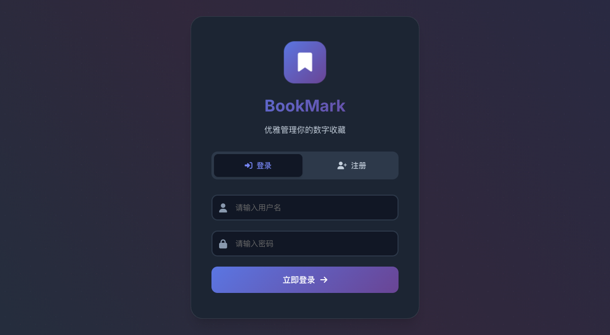
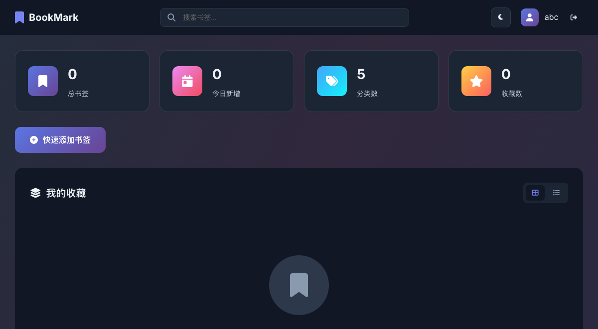
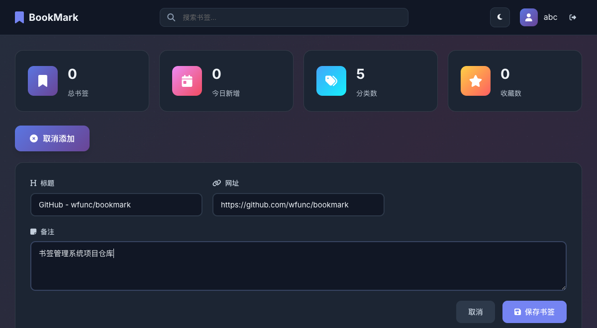

# 书签管理系统

一个支持 H5 和 PC 端的书签管理系统，具有用户认证、书签管理、拖拽排序等功能。

## 功能特性

- 🔐 用户注册与登录（带验证码保护）
- 📚 书签的增删改查
- 📝 支持为书签添加备注
- 📌 书签置顶功能
- 🔄 拖拽排序（PC端）
- 📱 响应式设计，支持移动端和PC端
- 🎨 现代化UI设计（玻璃拟态效果、暗黑模式）
- 🔍 书签搜索功能
- 📊 统计数据展示
- 📱 二维码生成与分享
- 🔄 新书签倒序显示（最新在前）
- 💾 数据持久化存储

## 技术栈

- **后端**: Go + Gin + GORM + SQLite
- **前端**: 原生 HTML/CSS/JavaScript + SortableJS + QRCode.js
- **认证**: JWT + 验证码保护
- **UI库**: Font Awesome 图标

## 安装与运行

### 1. 安装依赖

```bash
go mod download
```

### 2. 运行服务器

```bash
go run main.go
```

服务器默认运行在 `http://localhost:8080`

### 3. 访问应用

打开浏览器访问 `http://localhost:8080`

## 使用说明

1. **注册账号**: 首次使用需要注册一个新账号（需要输入验证码：888888）
2. **登录系统**: 使用注册的账号密码登录
3. **添加书签**: 填写标题、网址和备注（可选）
4. **编辑书签**: 点击编辑按钮修改书签信息
5. **置顶书签**: 点击置顶按钮将书签固定在列表顶部
6. **删除书签**: 点击删除按钮移除书签
7. **排序书签**: PC端可通过拖拽重新排序
8. **搜索书签**: 使用顶部搜索栏快速查找书签
9. **二维码分享**: 点击二维码按钮生成链接二维码
10. **主题切换**: 点击主题按钮切换明暗模式

## API 接口

### 认证相关
- `POST /api/register` - 用户注册（需要验证码）
- `POST /api/login` - 用户登录

### 书签管理
- `GET /api/bookmarks` - 获取书签列表（按置顶和时间倒序）
- `POST /api/bookmarks` - 创建新书签
- `PUT /api/bookmarks/:id` - 更新书签
- `DELETE /api/bookmarks/:id` - 删除书签
- `POST /api/bookmarks/reorder` - 重新排序书签
- `POST /api/bookmarks/:id/pin` - 切换书签置顶状态

## 环境变量

- `PORT` - 服务器端口（默认: 8080）

## 安全提示

在生产环境中，请务必：
1. 修改 `main.go` 中的 `jwtSecret` 为安全的密钥
2. 修改注册验证码 `REGISTRATION_CODE` 为你的专属验证码
3. 使用 HTTPS
4. 配置适当的 CORS 策略
5. 设置合适的数据库文件权限

## 项目截图

### 🔐 登录/注册界面

现代化的认证界面，支持用户注册和登录，采用玻璃拟态设计效果。

<table>
  <tr>
    <td width="50%">
      <h4>🌞 明亮模式</h4>
      
      <p><em>清新简洁的明亮主题，渐变背景配合玻璃效果</em></p>
    </td>
    <td width="50%">
      <h4>🌙 暗黑模式</h4>
      
      <p><em>护眼的暗黑主题，保持设计一致性</em></p>
    </td>
  </tr>
</table>

**✨ 界面特点：**
- 🎨 玻璃拟态效果 (Glass Morphism)
- 🔒 验证码保护机制 (验证码：112211)
- 📱 完美的响应式设计
- 🎯 直观的选项卡切换
- ⚡ 平滑的动画过渡效果

---

### 📚 书签管理主界面

功能丰富的主界面，集成了统计展示、搜索功能和书签管理。



**🎛️ 界面亮点：**
- 📊 **统计卡片**：总书签数、今日新增、分类统计
- 🔍 **智能搜索**：实时搜索书签标题、URL和备注
- 🎨 **主题切换**：一键切换明暗主题
- 👤 **用户中心**：显示当前用户信息
- 📌 **置顶功能**：重要书签可置顶显示

---

### ✨ 核心功能展示

#### 📝 快速添加书签



**功能特色：**
- 📋 **智能表单**：标题、URL、备注一步填写
- ✅ **实时验证**：URL格式自动检测
- 💾 **一键保存**：新书签自动排在最前面
- 🎯 **用户友好**：大按钮设计，易于点击

#### 📱 二维码分享


**分享功能：**
- 🔲 **即时生成**：点击即可生成二维码
- 📱 **移动友好**：扫码直接访问链接
- 💾 **一键下载**：支持保存二维码图片
- 📋 **复制链接**：快速复制URL到剪贴板
- 🎨 **美观界面**：模态框设计简洁大方

---

### 📱 移动端体验

<table>
  <tr>
    <td width="33%">
      <h4>🎯 触控优化</h4>
      <p>• 防止意外缩放<br>• 大按钮设计<br>• 手势友好</p>
    </td>
    <td width="33%">
      <h4>⚡ 性能优化</h4>
      <p>• 硬件加速<br>• 减少动画<br>• 流畅滚动</p>
    </td>
    <td width="34%">
      <h4>📐 自适应布局</h4>
      <p>• 响应式网格<br>• 灵活间距<br>• 完美适配</p>
    </td>
  </tr>
</table>

> **💡 使用提示：** 测试账号 `abc` / `112211`，注册需要验证码 `112211`

## 版本更新

### v1.0.0
- 基础书签管理功能
- 用户认证系统
- 响应式设计

### v2.0.0
- 新增验证码保护注册
- 新增书签置顶功能
- 新增二维码分享功能
- 新增搜索功能
- 优化UI设计（玻璃拟态效果）
- 新增暗黑模式
- 新书签倒序显示
- 移动端性能优化

## 许可证

MIT License